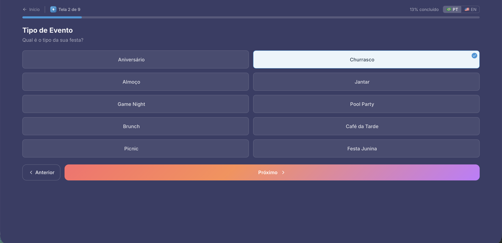
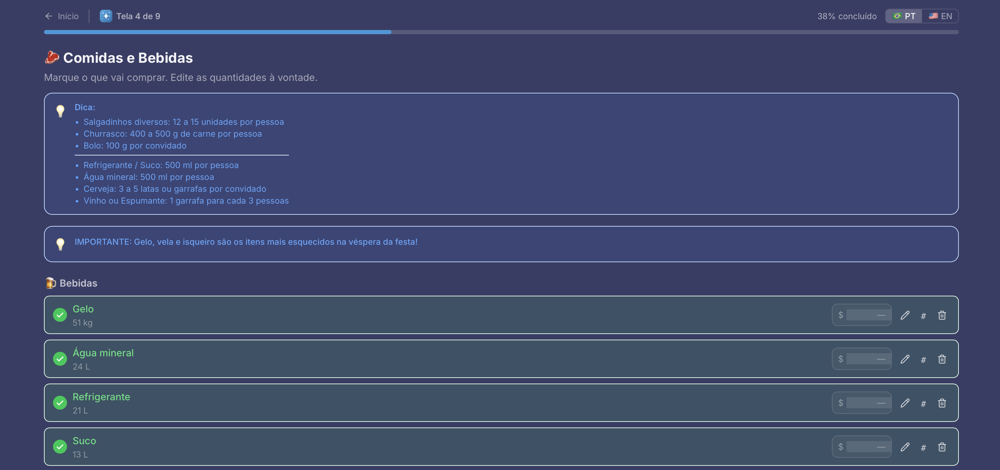
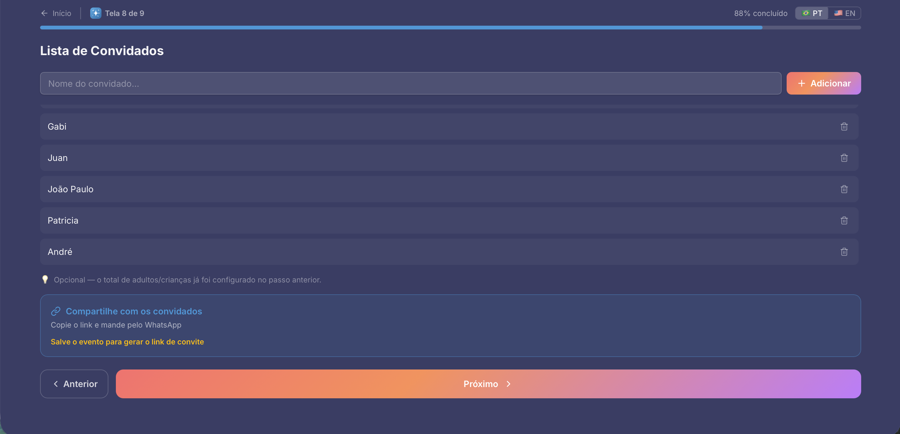
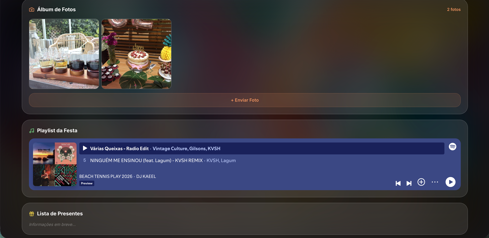

# Easy Party

Um aplicativo inteligente e guiado que transforma o estresse de planejar eventos em um fluxo de poucos minutos.

Easy Party centraliza planejamento, orçamento, convidados, RSVP, cronograma e compartilhamento do evento em uma única experiência.

**Planeje. Organize. Publique.**

---

## O Problema

Organizar uma festa ou evento normalmente exige o uso de diversas ferramentas diferentes:

* Planilhas para orçamento
* Aplicativos de mensagens para convidados
* Anotações para listas e tarefas
* Ferramentas separadas para convites e confirmações

Esse processo gera retrabalho, esquecimentos, dificuldade de acompanhamento e perda de controle sobre os custos.

Muitas pessoas acabam gastando mais tempo organizando do que aproveitando o próprio evento.

---

## A Solução

Easy Party resolve a sobrecarga mental do planejamento de eventos através de uma jornada guiada que acompanha o anfitrião desde a ideia inicial até a publicação do evento.

Tudo acontece em um único lugar:

✅ Planejamento Guiado

✅ Controle de Orçamento

✅ Checklists Inteligentes

✅ Gerenciamento de Convidados

✅ RSVP

✅ Cronograma

✅ Página Pública do Evento

✅ Convites Compartilháveis

---

## Como Funciona

### 1. Planejar

O sistema ajuda o anfitrião a construir o evento passo a passo, sem precisar começar com uma tela vazia.

O usuário informa detalhes como:

* Tipo de evento
* Quantidade de convidados
* Alimentação
* Bebidas
* Estrutura
* Decoração
* Orçamento

Com base nessas informações, o sistema cria automaticamente uma estrutura inicial de planejamento.

---

### 2. Organizar

Durante esta etapa o anfitrião pode:

* Gerenciar convidados
* Controlar orçamento
* Editar checklists
* Registrar despesas
* Criar cronograma
* Configurar detalhes do evento
* Personalizar a experiência dos convidados

Todas as informações permanecem privadas durante o planejamento.

---

### 3. Publicar

Quando estiver pronto, o evento pode ser publicado.

Uma página compartilhável é criada para os convidados, reunindo em um único local:

* Informações do evento
* RSVP
* Cronograma
* Álbum de fotos
* Playlist
* Comentários
* Localização
* Informações importantes

---

# Capturas de Tela

## Landing Page

A apresentação da proposta de valor do produto.

---

## Dashboard

Área principal para gerenciamento e acompanhamento dos eventos.

---

## Planejamento Guiado

### Informações do Evento

### Perfil do Evento

O fluxo guiado reduz a complexidade e ajuda o anfitrião a tomar decisões sem precisar começar do zero.

---

## Cálculos Inteligentes

O sistema gera automaticamente estimativas de comida e bebida com base nas características do evento e na quantidade de convidados.

Essa funcionalidade ajuda a reduzir desperdícios e simplifica uma das partes mais trabalhosas do planejamento.

---

## Organização do Evento

Gerenciamento centralizado de tarefas, orçamento, convidados e informações importantes do evento.

---

## Área do Anfitrião

Experiência completa para gerenciamento do evento, convidados e compartilhamento.

---

## Convite Compartilhável

Convite personalizado compartilhável por link e aplicativos de mensagem.

---

## Experiência do Convidado

Página pública dedicada aos convidados com informações centralizadas do evento.

---

# Principais Funcionalidades

### Planejamento Guiado

Fluxo estruturado para auxiliar a criação do evento.

### Checklists Inteligentes

Listas automáticas adaptadas ao perfil do evento.

### Controle de Orçamento

Acompanhamento financeiro durante todo o planejamento.

### Gerenciamento de Convidados

Controle da lista de convidados e confirmações de presença.

### RSVP

Gerenciamento simplificado de respostas dos convidados.

### Cronograma do Evento

Planejamento e organização das atividades do evento.

### Convite Compartilhável

Compartilhamento fácil através de links personalizados.

### Página Pública do Evento

Experiência dedicada aos participantes.

### Álbum Colaborativo

Compartilhamento de fotos pelos convidados.

### Integração com Spotify

Adicione playlists para complementar a experiência do evento.

### Suporte Bilíngue

* Português
* Inglês

---

# Stack Tecnológica

| Camada         | Tecnologia            |
| -------------- | --------------------- |
| Frontend       | React 19              |
| Linguagem      | TypeScript            |
| Build Tool     | Vite                  |
| Estilização    | Tailwind CSS v4       |
| Animações      | Framer Motion         |
| Roteamento     | Wouter                |
| Autenticação   | Supabase Auth         |
| Banco de Dados | PostgreSQL (Supabase) |
| Armazenamento  | Supabase Storage      |

---

# Status do Projeto

🚧 Em desenvolvimento ativo

O Easy Party está evoluindo continuamente através de testes, feedback de usuários e melhorias de experiência.

Novas funcionalidades, refinamentos de UX e melhorias visuais são adicionados regularmente.

---

# Direitos Autorais

Este repositório contém documentação pública do projeto Easy Party.

O código-fonte da aplicação é privado.

Todos os direitos relacionados ao produto, identidade visual, regras de negócio e implementação são reservados ao autor.
