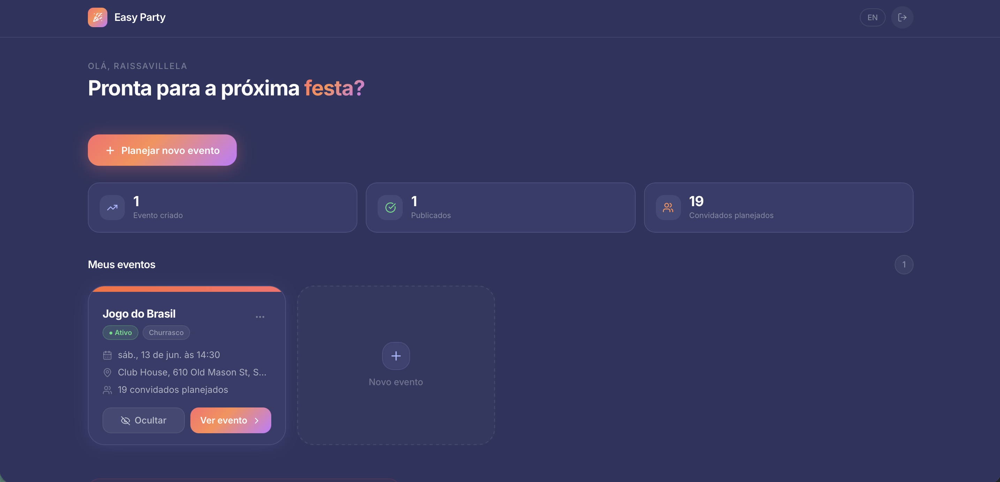
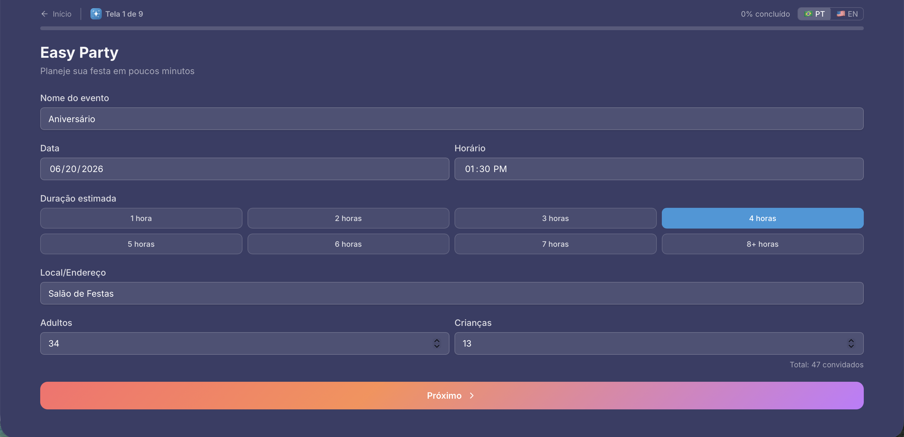
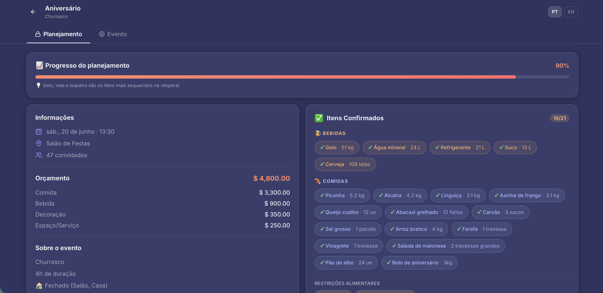

# Easy Party

Easy Party é uma plataforma inteligente de planejamento de eventos e gerenciamento de convidados criada para transformar a organização de festas e comemorações em um processo simples, guiado e eficiente.

Em vez de alternar entre planilhas, aplicativos de mensagens, anotações e ferramentas de convite, o anfitrião pode planejar, organizar e compartilhar seu evento em um único lugar.

---

## O Problema

Organizar um evento normalmente exige o uso de diversas ferramentas:

- Aplicativos de mensagens para comunicação
- Planilhas para orçamento
- Anotações para listas e tarefas
- Ferramentas separadas para convites e confirmações

Esse processo gera retrabalho, esquecimentos, dificuldade de acompanhamento e perda de controle sobre os custos.

---

## A Solução

Easy Party centraliza toda a experiência de planejamento de eventos em uma única plataforma.

O sistema foi projetado para pessoas que desejam organizar festas ou comemorações, mas se sentem sobrecarregadas pela quantidade de tarefas, cálculos e decisões necessárias.

### Nosso objetivo

> Permitir que o anfitrião passe menos tempo organizando e mais tempo aproveitando o evento.

---

# Como Funciona

O Easy Party foi estruturado em três etapas principais:

## 1. Planejar

Fluxo guiado para construção do evento.

O anfitrião responde perguntas sobre:

- Tipo de evento
- Quantidade de convidados
- Alimentação
- Bebidas
- Estrutura
- Decoração
- Orçamento
- Lista de convidados

Com base nessas respostas, o sistema cria automaticamente uma estrutura inicial de planejamento.

---

## 2. Organizar

Durante esta etapa o anfitrião pode:

- Gerenciar convidados
- Controlar orçamento
- Editar checklists
- Registrar despesas
- Criar cronograma
- Configurar detalhes do evento
- Personalizar a página pública

Todas as informações permanecem privadas durante o planejamento.

---

## 3. Publicar

Quando estiver pronto, o evento pode ser publicado.

Uma página compartilhável é criada para os convidados, contendo:

- Informações do evento
- RSVP
- Cronograma
- Álbum de fotos
- Playlist
- Comentários
- Localização
- Informações importantes

---

# Principais Funcionalidades

## Planejamento Guiado

Ajuda o anfitrião a tomar decisões passo a passo sem precisar começar do zero.

## Checklists Inteligentes

Listas automáticas geradas conforme o perfil e características do evento.

## Controle de Orçamento

Acompanhamento financeiro em tempo real durante o planejamento.

## Gerenciamento de Convidados

Controle de lista de convidados e confirmações de presença (RSVP).

## Cronograma do Evento

Organização das atividades do evento em uma linha do tempo simples e personalizável.

## Página Pública do Evento

Uma experiência dedicada aos convidados após a publicação.

## Convite Compartilhável

Compartilhamento de convites por link com visual personalizado.

## Álbum Colaborativo

Os convidados podem enviar fotos diretamente para o evento.

## Integração com Spotify

Inclusão de playlists para complementar a experiência.

## Suporte Bilíngue

Disponível em:

- Português
- Inglês

---

# Princípios de Produto

## Planejamento Guiado

O usuário não deve precisar começar com uma tela vazia.

O sistema orienta cada etapa do processo.

## Planejamento Antes da Publicação

Todo o trabalho acontece primeiro em um ambiente privado.

O anfitrião decide quando compartilhar o evento.

## Continuidade da Experiência

Os dados são persistidos para que o usuário possa interromper e continuar o planejamento a qualquer momento.

## Centralização

Menos ferramentas, menos retrabalho e menos complexidade.

---

# Principais Telas

## Landing Page

Apresentação da proposta de valor do produto.

---

## Dashboard

Área principal para gerenciamento dos eventos.

---

## Planejamento Guiado

Fluxo estruturado para criação e organização do evento.

---

## Página do Evento — Anfitrião

Experiência completa de gerenciamento do evento.

---

## Página do Evento — Convidado

Página pública utilizada pelos participantes.

---

## Convite Compartilhável

Visual de compartilhamento utilizado para divulgação do evento.

---

# Arquitetura da Aplicação

| Área | Descrição |
|--------|------------|
| Planejamento | Criação guiada do evento |
| Organização | Gerenciamento de convidados, orçamento e tarefas |
| Publicação | Página pública para convidados |
| RSVP | Controle de confirmações |
| Álbum | Compartilhamento de fotos |
| Cronograma | Organização da programação |
| Personalização | Temas e identidade visual |

---

# Stack Tecnológica

| Camada | Tecnologia |
|----------|------------|
| Frontend | React 19 |
| Linguagem | TypeScript |
| Build Tool | Vite |
| Estilização | Tailwind CSS v4 |
| Animações | Framer Motion |
| Roteamento | Wouter |
| Autenticação | Supabase Auth |
| Banco de Dados | PostgreSQL (Supabase) |
| Storage | Supabase Storage |

---

# Persistência de Dados

O sistema mantém e sincroniza informações relacionadas a:

- Eventos
- Convidados
- RSVP
- Orçamento
- Checklists
- Cronograma
- Fotos
- Configurações
- Personalizações visuais
- Playlists

---

# Status do Projeto

🚧 Em desenvolvimento ativo

O Easy Party está evoluindo continuamente através de ciclos de testes, feedback de usuários e melhorias de experiência.

Novas funcionalidades, refinamentos de UX e melhorias visuais são adicionados regularmente.

---

# Aprendizados

O projeto está sendo desenvolvido seguindo princípios de:

- Lean Startup
- Desenvolvimento Iterativo
- Descoberta de Clientes
- Feedback Contínuo
- Evolução Baseada em Dados

Uma das principais lições obtidas durante o desenvolvimento:

> Grandes produtos não nascem prontos. Eles evoluem através de aprendizado contínuo, validação e iteração.

---

# Licença

Este repositório contém documentação pública do projeto.

Todos os direitos relacionados ao produto, identidade visual, regras de negócio e implementação são reservados ao autor.